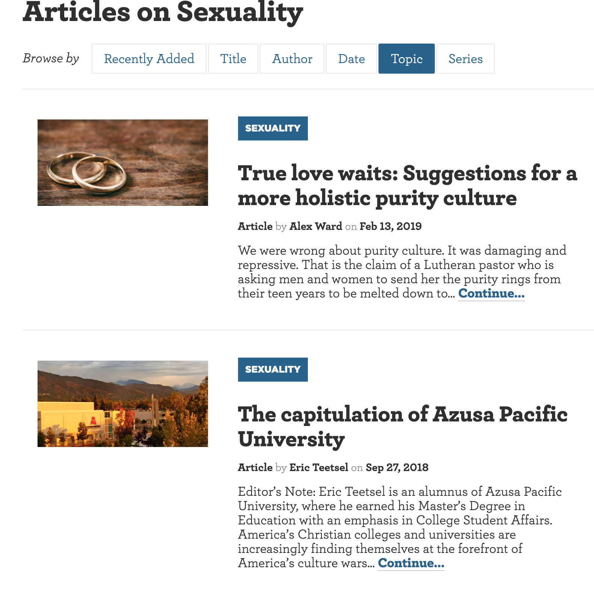
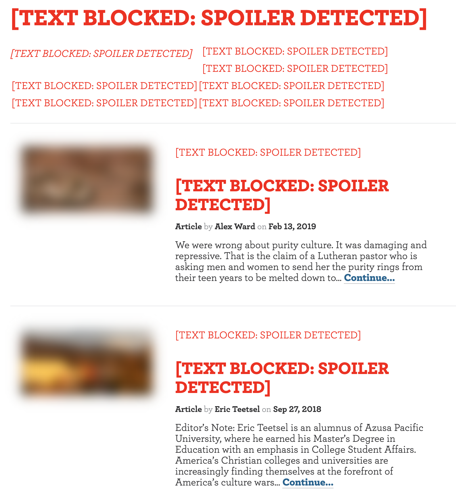

# protest bully: Hide +18 Content(Parent Control) - chrome Extension 
This extension will save you from reading any exploit content as well as visual images.  

This extension is developed by **Himanshu Agarwal**, a Software Engineer who is making world a better place by Contributing on  cool web projects, programming, data structures, algorithms, and more!   

> ## Never Under Estimate the power of a common Software Developer.

I am not an expert with Google Chrome Development and this is my first extension made ever. 
<h3>#Original Image</h3>
 
<h3>#After Extension use</h3>
 

# Features
- **Spoiler Blocking**: Searches entire web page and replaces Spoilers with text `##[TEXT BLOCKED: SPOILER DETECTED]`
- **Image Blurring**: Blurs the neighbouring Images which are relevant and might reveal the Spoiler information.
- **Simple, BugLess and Easy**: If there's a bug, it's a feature.
- **Open Source**: On serious note, if there's an issue, please log it and also raise a PR if you can fix it.
- **Customizable**: As you have the source code, you can customize it as per your needs ;) 

# How To Use?
- Clone this repository or download as a zip file
- Incase you downloaded as a zip, unzip it
- Open Google Chrome
- Go to `chrome://extensions`
- Click on `Load Unpacked` which you can see in the top left side.
- Select the path where you cloned/downloaded this project.

# Why this Chrome Extension exists?
When I created this extension, its purpose was: 
- An attempt to save other junior and childer from internet exploit use.
- To solve the problem of restricted data under age as a Software Developer
- To learn how to creat super cool Chrome Extensions

# Can I contribute?
Ofcourse! I will be shocked to see a notification saying `User {xyz} created a Pull Request.`  
I promise to approve the PR first, and only then review it.
